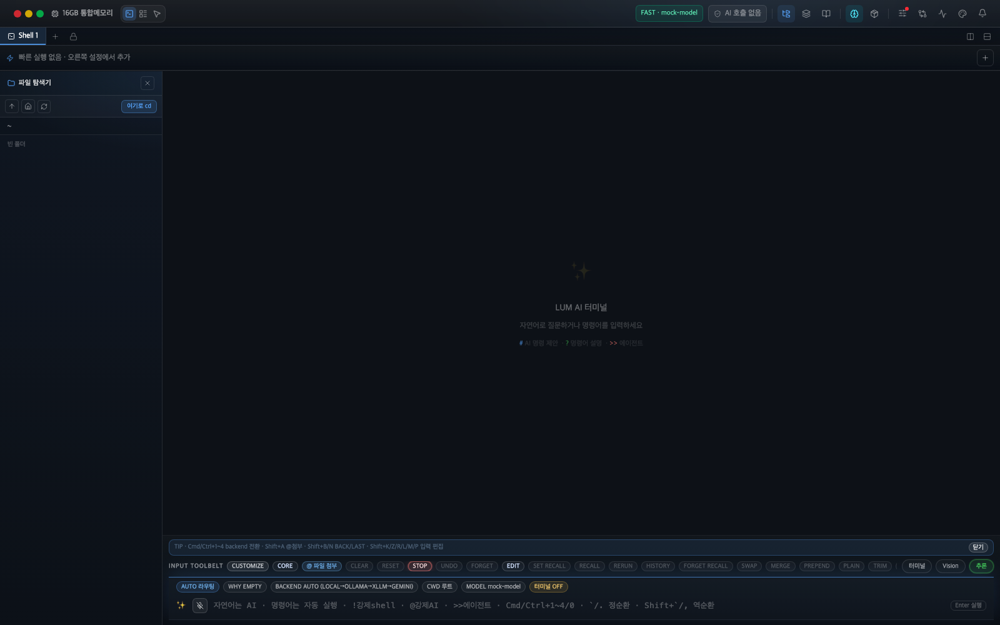

<div align="center">
  

# LUM Terminal

**A Warp-style AI terminal emulator with real PTY, local AI, and zero cloud dependency.**

[](LICENSE)
[](https://tauri.app)
[](https://www.rust-lang.org)
[](https://react.dev)
[](https://github.com/Code2731/Lum/releases/latest)

[](https://github.com/Code2731/Lum/releases/latest)
[](https://github.com/Code2731/Lum/releases/latest)
[](https://github.com/Code2731/Lum/releases/latest)

**[English](#english) · [한국어](#한국어)**

**GitHub Release:** [https://github.com/Code2731/Lum/releases/latest](https://github.com/Code2731/Lum/releases/latest)

</div>

---

## English

### What is LUM?

LUM (Local Universal Machine) is a **real terminal emulator** that runs your actual shell — not a chat UI. Built on [Tauri v2](https://tauri.app), it embeds [mistral.rs](https://github.com/EricLBuehler/mistral.rs) GGUF inference **directly inside the LUM process** — no subprocess, no HTTP server, no Python toolchain. Zero cloud calls, zero API fees, full privacy.

> Think of it as Warp Terminal, but fully open-source and running 100% on your own hardware.

### Key Features

| Feature | Description |
|---------|-------------|
| **Real PTY Terminal** | `portable-pty` runs your actual `$SHELL` (zsh/bash/PowerShell). xterm.js renders ANSI colors, scrollback, and VT100 sequences. |
| **AI Inline Edit** | Type `# find large files` → local AI converts it to the right shell command. Tab to confirm. |
| **AI Command Explain** | Type `? awk '{print $1}'` → AI explains what the command does in plain language. |
| **Agentic Task Loop** | Type `>> deploy the app` → AI plans multi-step tasks, shows a risk-annotated plan, and executes step by step with your approval. |
| **CLI Ghost Text** | Fish-shell style autocomplete for `git`, `npm`, `cargo`, `docker`, `kubectl`, and 30+ more CLIs. |
| **Semantic History** | `Ctrl+R` — embedding-based search across your entire command history. |
| **AI Commit Message** | `Cmd+Shift+G` — analyzes `git diff --cached` and generates a Conventional Commit message. |
| **AI Diff Reviewer** | `Cmd+Shift+R` — reviews staged changes and annotates each file as safe / caution / risk. |
| **AI Self-Healing** | Detects errors in terminal output → analyzes cause → suggests a fix with a safety badge. Approve/reject decisions feed the local learning loop. |
| **Self-Learning Loop** | Approved healing fixes → ChatML export → in-app LoRA fine-tune (mlx-lm/axolotl) → auto hot-swap into the running model. Rejections also tagged with "why it failed". 100% on-device. |
| **Persistent Memory Vault** | Unified semantic search across history / healing / memory sources. Time-windowed queries (today/week/month) + GDPR-style "right to forget". Cloud terminals can't keep permanent memory; LUM does. |
| **Worktree Squad** | Spawn isolated git worktrees + branches for parallel agent tasks (`~/.lum_squads/<id>` + `lum-squad/<id>`). Open each in a new tab without touching your main worktree. |
| **Privacy Ledger** | Header badge shows `100% On-Device` vs `Cloud N%` per AI call. Click for backend-by-backend stats — every inference call accounted for. |
| **Quake Mode** | Global hotkey `Cmd/Ctrl+Shift+Space` toggles the window from anywhere; auto-focuses the AI bar on show. |
| **MCP-augmented Agent** | The `>>` ReAct agent dynamically picks up tools from any enabled MCP server (filesystem / playwright / git / your own). Single `mcp({"server", "tool", "arguments"})` action surface. |
| **Code Editing Agent** | `>>` ReAct now writes code via `write_file` / `apply_patch` (rejects 0/2+ matches — forces self-correction) / `delete_file`. CWD-bounded SafePath guard (`.git`/`node_modules`/`target`/`.lum_*` denied). Every change auto-backed up to `~/.lum_react_backup/` — finish line shows risk-classified change list (Low test files / Med source / High build manifests) + one-click "Undo all" via `react_agent_undo`. |
| **Natural-Language Coding (No Prefix)** | Just type `"add an add() function and tests"` — verb+noun keyword router (KO/EN, ~24 verbs × ~24 nouns) auto-detects coding intent and routes to the ReAct agent. Explicit prefixes (`>>`/`!`/`@`) and shell commands always win. Misclassification recovered in 1s via auto-backup + undo. |
| **Multi-Backend Routing** | AI backends (embedded mistral.rs / Ollama / xLLM HTTP / Gemini) **coexist** — they use different resources. `@local` / `@ollama` / `@xllm` / `@gemini` prefix forces a specific backend per task — mix freely (e.g. `@gemini` for long-context analysis, `@local` for fast function edits). No prefix → automatic fallback chain. |
| **Split Panes** | Horizontal/vertical split with `Cmd+Shift+D/E`. Each pane has its own PTY session. |
| **Multi-Tab** | `Cmd+T` to open, `Cmd+W` to close, double-click to rename. |
| **SSH Profiles** | Connect to remote hosts via SSH; profiles saved to `~/.lum_ssh_profiles.json`. |
| **Session Persistence** | Tab layout and split state auto-saved and restored on restart. |
| **Terminal Themes** | 5 built-in themes (Dracula, Tokyo Night, One Dark, Solarized, GitHub Dark) + font controls. |
| **Quick Actions Bar** | Pin favorite commands; launch with `Cmd+1–9`. |
| **Hardware-Aware AI** | Auto-detects RAM and GPU → recommends the best GGUF model for your machine. |
| **Auto Update** | Background version check; one-click download and install via `tauri-plugin-updater`. |
| **Embedded GGUF Inference** | mistral.rs runs **in-process** (no subprocess, no HTTP). Real-time token streaming, mid-generation cancel, model hot-swap without app restart. |
| **Model Load Progress** | Elapsed-time counter + stage messages (`embed_load_progress` events) during 30s+ GGUF loading. |
| **Smart Env Auto-Loader** | Detects `.nvmrc`, `pyproject.toml`, `Pipfile`, `package.json`, etc. on `cd` → slide-up toast with one-click install commands. |
| **Script Library** | Save agent task runs as reusable scripts. Browse, run, and delete from a side panel (`Cmd+Shift+L`). |
| **Notification Center** | Aggregates long-running command completions, agent task results, healing triggers, and env detections in one bell-icon panel. |
| **Smart Paste** | Detects multi-line clipboard content → dialog to run all at once, step-by-step, or paste as raw text. |
| **Right-click Context Menu** | Right-click any selected terminal text → copy, run as command, AI explain, web search, or open file/URL. |
| **System Monitor** | `Cmd+Shift+M` — live CPU & memory gauges + top-6 processes by CPU and RAM, 2-second auto-refresh. |
| **LUM-MCP-server (Rust native)** | Standalone `lum-mcp-server` binary exposes 7 LUM tools (read_file / list_directory / git_diff / apply_edit_block / get_repo_map / run_tests / read_file_lines) via stdio MCP. CrewAI / Claude Desktop / any MCP client can drive LUM directly. |
| **DRAM/VRAM Tiering** | Auto-injected PagedAttention (`--pa-ctxt-len` + `--pa-gpu-mem-usage` linked to safety_mode 70/80/90%) makes 30B+ models practical on modest VRAM. |
| **Edit Block Engine** | SEARCH/REPLACE patches with exact-match + fuzzy whitespace fallback. AI proposes edits → user approves on the EditBlockCard → applied with diff preview. |
| **Repo Map (tree-sitter + PageRank)** | Token-budget-bounded codebase summary by symbol importance. Used as automatic AI context for refactoring tasks. |
| **Test Feedback Loop** | Auto-detect project test runner (cargo / pytest / npm / go) → run → on failure, AI proposes a fix → re-run loop. |
| **GPU Safety Mode** | `safe` (70% VRAM) / `balanced` (80%) / `max` (90%) with manual override slider. Feeds mistralrs PagedAttention via `--pa-gpu-mem-usage`. |
| **shadcn/ui Foundation** | Tailwind v4 + Radix primitives + `cn()` helper. Button + Dialog components ready; theme tokens mapped to LUM dark palette. |

### Architecture

```
User input (xterm.js onData)
        │
        │  Tauri IPC
        ▼
write_to_pty ──► SyncSender ──► Writer thread ──► PTY master ──► $SHELL
                                                        │
                                              Reader thread
                                                        │
                                             pty_data event
                                                        │
                                          xterm.js.write() ──► Screen
```

- **Backend** — Rust + Tauri v2. Channel-based PTY (writer / reader threads separated). AI routes to embedded mistralrs when a GGUF is loaded; otherwise to optional HTTP/Gemini fallback.
- **Frontend** — React 19 + TypeScript + Tailwind CSS v4 + shadcn/ui. xterm.js for rendering. Hooks for every major feature.
- **AI Layer** — mistral.rs **embedded GGUF** (in-process, `embedded-ai` Cargo feature) as primary; Gemini API as optional cloud fallback.
- **Local-AI Feature Flag** — `burn` / `wgpu` / `tokenizers` excluded from default build (~150 MB smaller binary).

### Tech Stack

- **Rust** — Tauri v2, portable-pty, reqwest, libp2p, sysinfo, serde, tree-sitter (Rust/TS/JS/Python), petgraph (PageRank), nvml-wrapper (NVIDIA VRAM)
- **Frontend** — React 19, TypeScript, Tailwind CSS v4, shadcn/ui (Radix + cva), xterm.js, react-resizable-panels, react-virtuoso
- **AI engines** — mistral.rs 0.8.1 embedded GGUF (in-process, CUDA, hot-swap, real-time streaming) + Gemini API (cloud fallback)
- **Agent ecosystem** — `lum-mcp-server` (Rust native stdio MCP, 7 tools — usable from external MCP clients such as Claude Desktop, CrewAI, or any custom agent)
- **Testing** — Vitest (TS 131 tests), Playwright (E2E smoke), `cargo test` (Rust 125+ tests)

E2E 실행:
- `npm run test` : 프론트엔드 유닛·통합 테스트
- `npm run test:e2e` : Playwright E2E (Vite 서버 자동 기동 시도)
- `npm run test:e2e:noserver` : 서버가 이미 실행 중일 때 E2E만 실행

### Getting Started

**Prerequisites**

- [Rust](https://www.rust-lang.org/tools/install) (stable)
- [Node.js](https://nodejs.org/) 20+
- **Optional for embedded GGUF inference** (depends on platform):
  - **Windows/Linux**: NVIDIA GPU + [CUDA Toolkit 12.x](https://developer.nvidia.com/cuda-downloads) + MSVC (Windows) — mistralrs CUDA backend
  - **macOS Apple Silicon (M1/M2/M3)**: Xcode (Metal SDK 포함) — mistralrs Metal backend
  - **macOS Intel / GPU 없음**: Gemini API 클라우드 폴백 권장

**Run in development**

> **Default mode = embedded mistral.rs in-process.** `npm run tauri dev` (no flags) is a *fallback*
> for environments without a GPU/CUDA toolchain — it skips mistralrs and falls back to external
> backends (Ollama / xLLM HTTP / Gemini) only.

```bash
git clone https://github.com/Code2731/Lum.git
cd Lum
npm install

# ── PRIMARY mode: embedded mistral.rs in-process ────────────────────────────
npm run tauri:dev:cuda                  # Windows/Linux + NVIDIA: mistralrs CUDA
npm run tauri:dev:metal                 # macOS Apple Silicon: mistralrs Metal
npm run tauri:dev:native                # EPERM/네트워크 바인딩 이슈 우회: 빌드 후 no-dev-server로 실행

# ── FALLBACK mode: lightweight (no embedded inference, ~150MB smaller binary)
npm run tauri dev                       # external LLM backends only (no on-device AI)
```

**Production build**

```bash
npm run tauri build                                # lightweight (no on-device inference)
npm run tauri build -- --features embedded-ai     # full build — Cargo가 OS에 맞춰 CUDA/Metal 자동 선택
```

### Playwright E2E 실행

```bash
# 기본 동작: Playwright가 127.0.0.1:1420 서버를 자동 시작/재사용 시도
npm run test:e2e

# 바인딩/권한 제약이 있는 환경: 서버를 먼저 띄운 뒤 실행
npm run dev -- --host 127.0.0.1 --port 1420
node scripts/run-e2e-noserver.js
```

- `npm run test:e2e:noserver`는 `E2E_NO_WEB_SERVER=1`을 내부에서 주입하므로 Windows/macOS/Linux 모두 동일하게 동작합니다.
- `E2E_NO_WEB_SERVER=1` 또는 `E2E_SKIP_WEBSERVER=1` 설정 시 Playwright가 `webServer`를 직접 띄우지 않습니다.
- `E2E_FALLBACK_PROJECTS`를 설정하면 noserver 실행 시 기본 `--project=chromium` 실패 시 대체 프로젝트를 순차 실행할 수 있습니다. 예: `E2E_FALLBACK_PROJECTS="chromium"`.
  - `webkit`/`firefox`를 넣으려면 `playwright.config.ts`의 `projects` 항목에 해당 프로젝트가 등록되어 있어야 합니다.
- 브라우저 런치가 계속 실패하면 다음 환경변수를 순차 적용해서 디버깅할 수 있습니다.
  - `E2E_USE_PLAYWRIGHT_CHROMIUM=1` : 시스템 Chrome/Edge 대신 Playwright 번들 Chromium을 강제 사용.
  - `E2E_CHROMIUM_ARGS="--disable-gpu --disable-dev-shm-usage --no-sandbox"` : Chromium launch 인자 강제.
  - `E2E_HEADLESS=0` : 헤드리스 실행 대신 headful로 시도 (GUI 가능 환경에서만).
  - `E2E_LAUNCH_PROFILES="default,bundled-chromium,headful,no-sandbox"` : 런치 시도 순서를 지정. 잘못된 값은 경고 후 무시됩니다. (대소문자 비구분, 중복 자동 제거)
  - `E2E_VERBOSE=1` : 현재 적용되는 fallback 프로젝트/프로필/커맨드 목록을 콘솔에 출력.
  - `E2E_DRY_RUN=1` : 실제 테스트 실행 없이 계획된 조합만 로그로 출력하고 종료.
  - 실패 시 스크립트가 `Playwright` 종료 로그에서 권한/바이너리 오류 패턴을 감지해 힌트를 출력합니다.
- CI에서는 기존 환경 변수로 이미 실행 중인 서버를 재사용하지 않도록 설정되어 있습니다.

### AI Setup (optional)

LUM works as a plain terminal with no AI server. To enable embedded local AI:

1. Build/run with `--features embedded-ai` (requires CUDA + MSVC)
2. **Model Manager** tab → search HuggingFace → download a GGUF (saved to `~/.lum_mistral_models/<repo>/`)
3. Open the **xLLM Settings** panel → 🧪 *Embedded Inference* section → select model folder + `.gguf` file → click *Load*
4. After load, every AI flow (`?` explain · `#` generate · `>>` agent · AI Chat sidebar · git commit message · diff review) automatically uses the embedded model — zero network calls

**Hot-swap**: Pick a different folder/file → click *Load* again → previous model VRAM released, new one loaded without restarting LUM.

**No GPU / no CUDA?** Set `GEMINI_API_KEY` in your environment — LUM falls back to Gemini cloud automatically.

### macOS launch troubleshooting

If LUM cannot start on macOS, check these steps in order:

1. Recommended: run one-shot install (download → install → launch):
   - `bash scripts/install-latest-lum-macos.sh`
2. If you prefer manual install:
   1. Fetch the matching DMG for this machine:
      - `bash scripts/download-latest-lum-macos.sh`
   2. Download the DMG matching your machine:
   - Apple Silicon → `*aarch64.dmg`
   - Intel → `*x64.dmg`
3. If needed, remove quarantine flags from the downloaded DMG and app:
   - `xattr -dr com.apple.quarantine ~/Downloads/LUM.Terminal_*.dmg`
   - `xattr -dr com.apple.quarantine "/Applications/LUM Terminal.app"`
4. For unsigned app behavior:
   - Right-click the app → **Open** at least once, then run it again.
   - If it still fails, open Terminal log:
     - `log show --predicate 'eventMessage contains "LUM Terminal"' --style syslog --last 5m`
5. If it still fails, re-download the DMG and retry. If there is still an error, attach the macOS Console output to this issue/PR.

### Platform Support

| Platform | Shell | Desktop Automation | Bundle |
|----------|-------|-------------------|--------|
| macOS (Apple Silicon) | zsh / bash | enigo | `.dmg` |
| macOS (Intel) | zsh / bash | enigo | `.dmg` |
| Windows | PowerShell / cmd.exe | enigo | `.msi` / `.exe` |
| Linux (X11) | bash / zsh | enigo | `.deb` / `.AppImage` |
| Linux (Wayland) | bash / zsh | not supported (use XWayland) | `.deb` / `.AppImage` |

---

## 한국어

### LUM이란?

LUM(Local Universal Machine)은 **실제 셸을 실행하는 터미널 에뮬레이터**입니다 — 채팅 UI가 아닙니다. [Tauri v2](https://tauri.app) 위에 구축되었으며, [mistral.rs](https://github.com/EricLBuehler/mistral.rs) GGUF 추론을 **LUM 프로세스 안에 직접 임베딩**합니다 — subprocess 없음, HTTP 서버 없음, Python 툴체인 없음. 클라우드 호출 없음, API 비용 없음, 완전한 개인정보 보호.

> Warp Terminal과 비슷하지만, 완전한 오픈소스이며 100% 사용자 하드웨어에서 동작합니다.

### 주요 기능

| 기능 | 설명 |
|------|------|
| **실제 PTY 터미널** | `portable-pty`로 실제 `$SHELL`(zsh/bash/PowerShell) 구동. xterm.js로 ANSI 색상·스크롤백·VT100 렌더링. |
| **AI 인라인 편집** | `# 대용량 파일 찾기` 입력 → 로컬 AI가 셸 명령어로 변환. Tab으로 확정. |
| **AI 명령어 설명** | `? awk '{print $1}'` 입력 → AI가 명령어를 평문으로 설명. |
| **에이전트 태스크 루프** | `>> 앱 배포` 입력 → AI가 다단계 계획 수립, 위험도 배지와 함께 표시 후 단계별 실행. |
| **CLI Ghost Text** | `git`, `npm`, `cargo`, `docker`, `kubectl` 등 38개+ CLI의 Fish-shell 스타일 자동완성. |
| **의미 기반 히스토리** | `Ctrl+R` — 임베딩 기반 자연어 명령어 히스토리 검색. |
| **AI 커밋 메시지** | `Cmd+Shift+G` — `git diff --cached` 분석 후 Conventional Commit 자동 생성. |
| **AI Diff 리뷰어** | `Cmd+Shift+R` — 스테이지된 변경사항을 파일별 safe / caution / risk로 분석. |
| **AI 자가 치유** | 터미널 에러 자동 감지 → 원인 분석 → 안전도 배지와 함께 수정 명령어 제안. 승인/거부 결정이 로컬 학습 루프의 입력. |
| **자가 학습 루프** | 승인된 치유 → ChatML export → 인앱 LoRA 파인튜닝(mlx-lm/axolotl) → 학습 완료 시 모델 자동 hot-swap. 거부도 "왜 잘못됐는지" 태깅. 100% 온디바이스 — 클라우드 제품은 데이터 보관정책상 불가. |
| **영구 메모리 Vault** | history / healing / memory 3소스를 단일 시맨틱 검색으로 통합. 시간 필터(오늘/1주/1달) + GDPR-style "잊혀질 권리". |
| **Worktree Squad** | 병렬 에이전트 작업을 격리된 git worktree + 브랜치(`~/.lum_squads/<id>` + `lum-squad/<id>`)로 spawn. 각 squad를 새 탭에서 열 수 있음 — 메인 워킹트리는 안 건드림. |
| **Privacy Ledger** | 헤더 배지에 `100% On-Device` 또는 `Cloud N%` 표시. 클릭 시 백엔드별 호출 통계·평균 latency·최근 호출 popover. |
| **Quake 모드** | 전역 단축키 `Cmd/Ctrl+Shift+Space`로 창 토글 + AI 바 자동 포커스. 어디서든 즉시 호출. |
| **MCP-augmented Agent** | `>>` ReAct 에이전트가 활성 MCP 서버(filesystem / playwright / git / 사용자 정의)의 도구를 동적으로 가져와 호출. 단일 `mcp({"server", "tool", "arguments"})` 액션. |
| **코딩 에이전트** | `>>` ReAct가 이제 `write_file` / `apply_patch`(0건/2건+ 매칭 거부 — LLM 자가 복구 강제) / `delete_file`로 코드 직접 수정. CWD 경계 SafePath 가드(`.git`/`node_modules`/`target`/`.lum_*` 거부). 변경마다 `~/.lum_react_backup/`에 자동 백업 → 완료 시 위험도 분류 변경 파일 목록(Low 테스트 / Med 소스 / High 빌드 매니페스트) + 원클릭 "전체 되돌리기"(`react_agent_undo`). |
| **자연어 바이브코딩 (Prefix 불필요)** | `"utils.ts에 add 함수 추가해줘"` 그냥 입력 → 동사+명사 키워드 라우터(한/영, 24동사 × 24명사)가 코딩 의도 자동 감지 → ReAct 자동 발동. 명시적 prefix(`>>`/`!`/`@`)와 셸 명령은 항상 우선. 오분류 시 자동 백업 + undo로 1초 복구. |
| **Multi-Backend 라우팅** | AI 백엔드(임베디드 mistral.rs / Ollama / xLLM HTTP / Gemini)는 자원이 다르므로 **공존**. `@local` / `@ollama` / `@xllm` / `@gemini` prefix로 작업별 backend 강제 — `@gemini 큰 컨텍스트 분석`, `@local 빠른 함수 추가` 같이 혼합 사용. 백엔드 미지정 시 자동 fallback chain. |
| **스플릿 팬** | `Cmd+Shift+D/E`로 수평/수직 분할. 각 팬은 독립 PTY 세션. |
| **멀티 탭** | `Cmd+T` 새 탭, `Cmd+W` 닫기, 더블클릭으로 이름 변경. |
| **SSH 프로필** | SSH 원격 연결 및 프로필 저장(`~/.lum_ssh_profiles.json`). |
| **세션 영속성** | 탭 레이아웃·분할 상태 자동 저장 → 재시작 시 복원. |
| **터미널 테마** | 5개 내장 테마(Dracula, Tokyo Night, One Dark, Solarized, GitHub Dark) + 폰트 컨트롤. |
| **퀵 액션 바** | 자주 쓰는 명령어 고정; `Cmd+1~9`로 즉시 실행. |
| **하드웨어 인식 AI** | RAM·GPU 자동 감지 → 최적화된 GGUF 모델 추천. |
| **자동 업데이트** | 백그라운드 버전 확인; 원클릭 다운로드·설치. |
| **임베디드 GGUF 추론** | mistral.rs를 **LUM 프로세스 내부**에서 직접 실행 — subprocess·HTTP 서버 없음. 토큰별 실시간 스트리밍 + 추론 중 즉시 중단 + 앱 재시작 없이 모델 핫스왑. |
| **모델 로드 진행 표시** | 30s+ 걸리는 GGUF 로드 중 경과 초 카운터 + 단계 메시지 (`embed_load_progress` 이벤트) 실시간 표시. |
| **스마트 환경 자동 로더** | `cd` 시 `.nvmrc`, `pyproject.toml`, `Pipfile`, `package.json` 등 감지 → 설치 명령어 슬라이드업 토스트. |
| **스크립트 라이브러리** | 에이전트 태스크를 재사용 스크립트로 저장·실행 (`Cmd+Shift+L`). |
| **알림 센터** | 장시간 명령어·에이전트·AI 치유·환경 감지 이벤트를 벨 아이콘 패널에 통합. |
| **스마트 붙여넣기** | 멀티라인 클립보드 자동 감지 → 한 번에 실행 / 단계별 실행 / 텍스트 그대로 붙여넣기 선택 다이얼로그. |
| **우클릭 컨텍스트 메뉴** | 터미널 텍스트 선택 후 우클릭 → 복사 / 명령어 실행 / AI 설명 / 웹 검색 / 파일·URL 열기. |
| **시스템 모니터** | `Cmd+Shift+M` — CPU·메모리 게이지 + CPU/메모리 상위 프로세스 6개, 2초마다 자동 갱신. |
| **LUM-MCP-server (Rust 네이티브)** | 별도 `lum-mcp-server` 바이너리가 LUM 도구 7개(read_file / list_directory / git_diff / apply_edit_block / get_repo_map / run_tests / read_file_lines)를 stdio MCP로 노출. CrewAI / Claude Desktop / 모든 MCP 클라이언트가 LUM을 직접 제어 가능. |
| **DRAM/VRAM 계층화** | PagedAttention 자동 주입 (`--pa-ctxt-len` + safety_mode 70/80/90% 연동 `--pa-gpu-mem-usage`)으로 modest VRAM 환경에 30B+ 모델 실용화. |
| **편집 블록 엔진** | SEARCH/REPLACE 패치 (exact match + fuzzy whitespace 폴백). AI 제안 → EditBlockCard에서 사용자 승인 → diff 미리보기 후 적용. |
| **레포 맵 (tree-sitter + PageRank)** | 토큰 예산 기반 코드베이스 요약 (symbol 중요도순). 리팩토링 작업의 AI 자동 컨텍스트. |
| **테스트 피드백 루프** | 프로젝트 테스트 러너 자동 감지 (cargo / pytest / npm / go) → 실행 → 실패 시 AI 수정 제안 → 재실행 루프. |
| **GPU 안전 모드** | `safe` (70% VRAM) / `balanced` (80%) / `max` (90%) + 수동 슬라이더. mistralrs PagedAttention `--pa-gpu-mem-usage` 자동 연동. |
| **shadcn/ui 토대** | Tailwind v4 + Radix primitives + `cn()` 헬퍼. Button + Dialog 컴포넌트 즉시 사용 가능; 테마 토큰을 LUM 다크 팔레트에 매핑. |

### 시작하기

**필수**

- [Rust](https://www.rust-lang.org/tools/install) (stable)
- [Node.js](https://nodejs.org/) 20+
- **임베디드 GGUF 추론용 (플랫폼별)**:
  - **Windows/Linux**: NVIDIA GPU + [CUDA Toolkit 12.x](https://developer.nvidia.com/cuda-downloads) + MSVC (Windows) — mistralrs CUDA 백엔드
  - **macOS Apple Silicon (M1/M2/M3)**: Xcode (Metal SDK 포함) — mistralrs Metal 백엔드
  - **macOS Intel / GPU 없음**: Gemini API 클라우드 폴백 권장

**개발 모드**

> **기본 모드 = 임베디드 mistral.rs in-process.** `npm run tauri dev`(인자 없음)는 *폴백* —
> GPU/CUDA toolchain 없는 환경용으로, mistralrs를 빌드에서 제외하고 외부 백엔드(Ollama /
> xLLM HTTP / Gemini)만 사용합니다.

```bash
git clone https://github.com/Code2731/Lum.git
cd Lum
npm install

# ── 정상 모드: 임베디드 mistral.rs in-process ───────────────────────────────
npm run tauri:dev:cuda          # Windows/Linux + NVIDIA: mistralrs CUDA
npm run tauri:dev:metal         # macOS Apple Silicon: mistralrs Metal
npm run tauri:dev:native        # 네트워크 바인딩 실패 환경용 우회 모드 (사전 빌드 후 no-dev-server 실행)

# ── 폴백 모드: 경량 (임베디드 추론 X, 바이너리 ~150MB 작음)
npm run tauri dev               # 외부 LLM 백엔드만 (on-device AI 없음)
```

**프로덕션 빌드**

```bash
npm run tauri build                                # 경량 (on-device 추론 없음)
npm run tauri build -- --features embedded-ai     # OS별 CUDA/Metal 자동 선택
```

### macOS 실행 문제 해결

macOS에서 LUM이 실행되지 않을 때는 순서대로 확인하세요.

1. 권장: 한 번에 설치(다운로드 → 설치 → 실행):
   - `bash scripts/install-latest-lum-macos.sh`
2. 수동으로 하려면 순서를 따라주세요.
   1. 프로젝트 스크립트로 현재 아키텍처에 맞는 DMG를 받아보세요.
      - `bash scripts/download-latest-lum-macos.sh`
   2. 사용 중인 CPU 아키텍처에 맞는 DMG를 받았는지 확인합니다.
      - Apple Silicon → `*aarch64.dmg`
      - Intel → `*x64.dmg`
3. 필요한 경우 다운로드한 DMG와 앱의 격리 플래그를 제거합니다.
   - `xattr -dr com.apple.quarantine ~/Downloads/LUM.Terminal_*.dmg`
   - `xattr -dr com.apple.quarantine "/Applications/LUM Terminal.app"`
4. 서명 미등록 앱은 우클릭 → **열기**를 먼저 1회 실행한 뒤 다시 실행해 보세요.
5. 실행 로그가 필요하면 다음으로 최근 로그를 확인합니다.
   - `log show --predicate 'eventMessage contains "LUM Terminal"' --style syslog --last 5m`
6. 그래도 실행되지 않으면 DMG를 다시 받았는지 확인하고, Console 로그(오류 메시지)와 함께 이슈를 남겨주세요.

**AI 기능 활성화 (선택)**

1. `--features embedded-ai`로 빌드/실행 (CUDA + MSVC 필요)
2. **모델 매니저** 탭 → HuggingFace 검색 → GGUF 다운로드 (`~/.lum_mistral_models/<repo>/`에 저장)
3. **xLLM 설정** 패널 → 🧪 *임베디드 추론* 섹션 → 모델 폴더 + `.gguf` 파일 선택 → *로드*
4. 로드 후 모든 AI 흐름(`?` 설명 · `#` 명령어 생성 · `>>` 에이전트 · AI Chat 사이드바 · git 커밋 메시지 · diff 리뷰)이 자동으로 임베디드 모델 사용 — 네트워크 호출 0

**핫스왑**: 다른 폴더/파일 선택 → *로드* 다시 클릭 → 이전 모델 VRAM 해제 + 새 모델 로드, 앱 재시작 불필요.

**GPU 또는 CUDA 없음?** 환경변수에 `GEMINI_API_KEY` 설정 → LUM이 자동으로 Gemini 클라우드 폴백.

### 개발 로드맵

#### 최근 모트 (Phase 115 ~ 128)

| Phase | 변경 | 영향 |
|-------|------|------|
| **115** | Privacy Ledger + Quake Mode | AI 호출별 backend·on-device 비율 가시화. 전역 단축키로 어디서든 호출 |
| **116** | Worktree Squad | 병렬 에이전트 작업을 격리된 git worktree + 브랜치로 spawn |
| **117** | Auto-Heal 학습 데이터셋 | 사용자 승인/거부 결정을 JSONL append-only로 영속, ChatML export 지원 |
| **118** | Persistent Memory Vault | history / healing / memory 통합 시맨틱 검색 + GDPR-style 잊혀질 권리 |
| **119** | LoRA Forge | 인앱 mlx-lm/axolotl 서브프로세스 오케스트레이션 — 본인 데이터로 본인 모델 fine-tune |
| **120** | Auto-Learning Loop | approve threshold 도달 시 자동 학습 트리거 + 호환 어댑터 자동 hot-swap |
| **121** | UI 정리 + 안정화 + MCP↔ReAct | 툴바 16→8+8 토글, mistralrs 학습 timeout, ReAct에 MCP 도구 동적 주입 |
| **122** | Active Learning v2 | reject 시 LLM이 "왜 잘못된 제안인지" 1줄 분석 → DPO 데이터 소스 |
| **123** | Code Editing Agent (1차/2차/3차) | ReAct에 `write_file`/`apply_patch`/`delete_file` + SafePath 가드 + 자동 백업/되돌리기(`react_agent_undo`) + 위험도 분류 사후 승인 UI(Low/Med/High 배지). 클라우드 코딩 에이전트 격차 ~70% 회수 |
| **124** | 자연어 바이브코딩 라우팅 | `inputRouter`에 동사+명사 결정적 의도 감지 — `>>` prefix 없이 자연어로 "X 추가해줘" 치면 자동 ReAct 발동. Phase 123 안전망이 오분류를 흡수해 Warp 수준 UX 달성 |
| **125-1** | Multi-Backend prefix | AI 백엔드 공존 인정 — `@local`/`@ollama`/`@xllm`/`@gemini` prefix로 작업별 backend 강제. 자원 다른 백엔드들을 unload 강제 없이 혼합 사용. 2~3차에 Rust forwarding + UI chip + 자동 정책 |
| **126** | UX 일원화 + 코드베이스 정리 | (1) localStorage 3개(파일탐색기·힌트·AI폰트) → `.lum_config.json` 단일 소스(머신간 동기화 가능). (2) `App.tsx` 1576→1083줄 분해 — `AppHeader`(헤더/툴바/Privacy Ledger 480줄) + `AppOverlays`(13개 모달 일괄 310줄) 추출. (3) Advanced 팝오버 미클릭 신기능에 amber "NEW" 라벨 + `ui_seen_advanced_features` 영속. (4) **`crew/` 제거** — Python CrewAI는 LUM 본체와 미연결 stale 코드였음. 모트 메시지를 "임베디드 추론 + LoRA 학습 루프"로 명확화 |
| **127** | Skills 시스템 (자연어 → 사용자 절차 자동 호출) | "한 번 푼 문제는 두 번 풀지 않는다." 사용자가 markdown 절차를 저장 → 다음 ReAct 호출 시 goal 단어와 트리거/이름/설명 키워드 overlap top-3을 시스템 프롬프트에 자동 주입(`find_relevant_skills`). 저장: `~/.lum_skills.json`. 명령: `skill_list/save/delete/search/record_use`. UI: `SkillsPanel` (이름/설명/트리거/markdown body 편집) — Advanced popover에 NEW 배지. Hermes Agent의 agentskills.io와 결이 같음 — LoRA(weight)는 즉시 재사용 안 되지만 skill(prompt-level memo)은 즉시 효과. 두 시스템 직교 |
| **128** | LAN LLM Discovery | 로컬 네트워크의 Ollama / LM Studio / mlx_lm.server / TabbyAPI / llama.cpp 서버를 한 번 클릭으로 검색. `/24` 서브넷 × 5개 알려진 포트(11434/1234/8080/8081/5000)를 `buffer_unordered(200)`로 1~3초 안에 동시 probe → TCP open된 곳만 HTTP fingerprint(`/api/tags` 또는 `/v1/models`) → JSON 모양으로 종류 분류. 결과 카드에 "사용" 버튼 → `ollama_base_url` 또는 `xllm_base_url` 즉시 저장. 자동 스캔 안 함(사내망 IDS 회피). XllmPanel에 새 섹션 |

<details>
<summary>Phase 23 ~ 92 전체 완료 목록 보기</summary>

- [x] Phase 23: Real PTY Terminal (portable-pty + xterm.js)
- [x] Phase 24: Cross-Platform Polish
- [x] Phase 25: AI Self-Healing Loop
- [x] Phase 27: Multi-Tab PTY
- [x] Phase 28: Split Pane Terminal
- [x] Phase 29: Command Blocks (OSC 133 Shell Integration)
- [x] Phase 30: Semantic History Search
- [x] Phase 31: AI Commit Message
- [x] Phase 32: xLLM 실전 최적화 (PD Disaggregation, Elastic Scheduling, KV Cache)
- [x] Phase 33: CLI Ghost Text + Session Persistence
- [x] Phase 34: AI Inline Edit (`#` 프리픽스)
- [x] Phase 35: AI Context Awareness (프로젝트 타입 자동 감지)
- [x] Phase 36: Auto Update Check
- [x] Phase 37: SSD + Sparse Attention + EPD Streaming
- [x] Phase 38: First-Run Onboarding Wizard
- [x] Phase 39: AI Diff Reviewer
- [x] Phase 40: Terminal Themes & Font
- [x] Phase 41: Quick Actions Bar
- [x] Phase 42: Smart Tab Rename & Auto-Icon
- [x] Phase 43: Terminal Search (`Cmd+F`)
- [x] Phase 44: AI Explain Command (`?` 프리픽스)
- [x] Phase 45: Long-Running Command Notifier
- [x] Phase 46: Workspace Save & Restore
- [x] Phase 47: SSH Terminal
- [x] Phase 48: CLI Autocomplete DB 확장 (38개 CLI)
- [x] Phase 49: Smart Diff Truncation
- [x] Phase 50: React ErrorBoundary
- [x] Phase 51: Playwright E2E 테스트
- [x] Phase 52: SSH 프로필 영속성
- [x] Phase 53: 자동 업데이트 설치
- [x] Phase 54: local-ai Feature Flag (~150MB 절감)
- [x] Phase 55: Agentic Task Loop (`>>` 프리픽스)
- [x] Phase 56: AI Chat Sidebar (`Cmd+Shift+A` — 멀티턴 대화, 터미널 컨텍스트 자동 주입)
- [x] Phase 57: Smart Environment Auto-Loader (cwd 변경 시 환경 파일 자동 감지, 설치 명령어 슬라이드업 토스트)
- [x] Phase 58: Script Library (`Cmd+Shift+L` — 에이전트 태스크 저장·재실행, 스크립트 패널)
- [x] Phase 59: Notification Center (명령/에이전트/힐링/환경 이벤트 통합 벨 아이콘 패널)
- [x] Phase 60: Smart Paste (멀티라인 붙여넣기 감지 → 한 번에 실행 / 단계별 실행 / 텍스트 붙여넣기 선택 다이얼로그)
- [x] Phase 61: Right-click Context Menu (선택 텍스트 우클릭 → 복사 / 명령어 실행 / AI 설명 / 웹 검색 / 파일·URL 열기)
- [x] Phase 62: System Monitor (Cmd+Shift+M — CPU/메모리 게이지, 상위 프로세스, 2초 폴링)
- [x] Phase 63: Apple Silicon MLX-LM 전환 (aarch64 분기 자동 적용)
- [x] Phase 64: AI Chat 코드베이스 인식 (cwd / git / 최근 파일 자동 컨텍스트)
- [x] Phase 65~66: Model Manager 확장 (MLX/EXL2 카테고리 필터, NVIDIA 전용 기능 ⚠ 배지)
- [x] Phase 67: Windows 크로스플랫폼 완전 지원 (TabbyAPI venv .venv\Scripts\, nvidia-smi VRAM 감지, 14B EXL2 추천)
- [x] Phase 68: File Explorer + Welcome Hints (Cmd+B 토글, OS별 open 분기)
- [x] Phase 69: Warp 스타일 UX 전면 개편 (WarpInputBar 자연어 기본 + 셸 fast-path + AI 인라인 스트림)
- [x] Phase 70: Repo Map + SEARCH/REPLACE Edit Engine (tree-sitter + petgraph PageRank, fuzzy fallback, EditBlockCard)
- [x] Phase 71: GPU 안전 모드 (safe 70% / balanced 80% / max 90% + 슬라이더 override, NVML 정확 VRAM)
- [x] Phase 72: 모델 capability 토글 (vision / reasoning, `<think>` 체인 UI 숨김)
- [x] Phase 73: 테스트 피드백 루프 (test_runner 자동 감지 + 실패 시 AI 자가 수정)
- [x] Phase 74~77: MCP 클라이언트 + 도구 통합 + 비전 모델 이미지 전달
- [x] Phase 78~79: mistral.rs 진짜 통합 (Windows hf-hub 0.4.3 panic 우회) + Dual Engine UX 정합화 (다운로드 분리·갱신 버튼·상태 표시)
- [x] Phase 80: TDD 회귀 가드 (build_mistral_args / classify_repo_http_code 등 4개 헬퍼 추출) + 터미널 Ctrl+C/V
- [x] Phase 81: CrewAI 통합 + Heavy 한계 발견 (`crew/` 별도 Python, lum_llm.py 공통 헬퍼, lessons learned: thinking 모델은 multi-agent 부적합)
- [x] Phase 82a/b: LUM-MCP-server (Rust 네이티브 stdio JSON-RPC, 7개 도구 노출, Cargo `[[bin]]`로 분리)
- [x] Phase 82c: CrewAI ↔ lum-mcp 통합 (MCPServerAdapter + StdioServerParameters, 7개 도구 BaseTool 자동 변환)
- [x] Phase 83: DRAM/VRAM 계층화 자동화 (mistral.rs `--pa-ctxt-len`/`--pa-gpu-mem-usage`/`-n` 자동 주입, safety_mode 연동, 30B+ 실용화)
- [x] Phase 84: SSD (Speculative Decoding) 서버 사이드 통합 (TabbyAPI `config.yml`에 `draft_model:` 섹션 자동 주입, 폴더 검증 후 활성/비활성 결정, Phase 37 body 인자가 진짜 동작; Cargo `default-run = "tauri-app"` 회귀 fix)
- [x] Phase 84c: Dynamic Sparse Attention 제거 (TabbyAPI/ExLlamaV2 0.3.2 미지원 확인 — body 인자/UI/필드 전체 삭제, 진짜 구현은 Phase 86+ vLLM/SGLang 도입 시)
- [x] Phase 84b: SSD 동작 검증 + UI 정리
- [x] Phase 85d: ModelManager UI dead branch 통째 정리 (987줄 → 352줄, −64%) — EXL2 직접 입력(TabbyAPI Fast Track) 섹션 + EXL2 카탈로그 list + Apple Silicon 분기 + MLX 카탈로그 + MLX-LM 진행률 + `useModel`/`switch_xllm_model`(TabbyAPI 시절 스위치) + 죽은 props 통째 제거. 설치된 모델 탭 데이터 소스 `list_local_models`(~/tabby/models, 빈 화면) → `list_mistral_models`(~/.lum_mistral_models, 실제 데이터)로 스왑. 신규 `delete_mistral_model` Tauri 커맨드(path traversal 방지). Rust 72 + TS 131 테스트 회귀 0.
- [x] Phase 85c: 죽은 자산 정리 (~33GB 회수 — 30B-A3B GGUF panic 모델 + ~/tabby/ EXL2 4개 + tabbyAPI venv 삭제, 임베디드 검증 7B GGUF만 유지); 부수 효과로 hf CLI 의존 깨짐 → 다음 phase에 hf-hub Rust crate 통합 후보
- [x] Phase 85b: mistralrs LUM 프로세스 임베딩 (subprocess 0 / HTTP 0) — GgufModelBuilder 직접 호출, `commands/embed.rs` cfg 분기 facade, 모델 폴더/파일 자동 드롭다운, `call_xllm()` 임베디드 우선 분기, mistralrs-server.exe spawn 코드 + Heavy/Fast 라우팅 통째 제거; CUDA + MSVC env wrapper(`scripts/tauri-dev-cuda.bat`); 검증: 7B Q4_K_M GGUF로 `?` 입력 → 한국어 응답 (Phase 83b candle MoE panic은 dense 모델에 영향 없음); 누적 ~-3000줄 net
- [x] Phase 85a: TabbyAPI 통째 제거 (AI Agent 시연 부적합 — CrewAI tool_calls 미지원·시작 멈춤 등 검증 후 mistral.rs 단일 엔진 통일; 3 commits / ~1200줄 net 삭제 / `tabbyapi_setup.rs` 957줄 + invoke_handler 7개 + UI 11 state·4 useCallback·3 listener 정리; 잔여 deprecated UI + mistralrs-core 임베딩은 Phase 85b)
- [x] Phase 85e: XllmPanel.tsx dead field 정리 (cache_mode/draft_model/speculative_n_draft TabbyAPI SSD 흔적 제거)
- [x] Phase 86: reqwest 기반 순수 Rust HF 다운로더 (외부 hf CLI 의존 제거 — `hf_download_file` 5% 단위 진행률 emit, `hf_list_repo_files` HF API `/api/models/{repo}` 조회)
- [x] Phase 87: mistral 모델 다운로드 취소 지원 (`AtomicBool` 청크 루프 폴링, ModelManager [다운로드↔취소] 토글 + 프리셋 카드 펄스 애니)
- [x] Phase 88: 임베디드 AI 모델 핫스왑 (앱 재시작 없이 모델 교체 — `OnceCell<Arc<Model>>` → `OnceLock<Mutex<Option<LoadedState>>>` 전환, `unload_model()` VRAM 명시 해제, `loaded_key()` UI 폴링)
- [x] Phase 89: 모델 로드 진행 표시 (`embed_load_progress` 이벤트 + 경과 초 카운터, `XllmPanel` 동적 버튼 레이블 `"🔄 로드 중... 34초"`)
- [x] Phase 90: 메인 AI 백엔드 임베디드 라우팅 통합 (`current_engine()` 죽은 참조 fix, `try_embedded_inference` cfg-gated 헬퍼, `?` explain · `#` generate · `>>` agent · git · diff 분석 + WarpInputBar 스트리밍 + AI Chat 모두 임베디드 자동 사용)
- [x] Phase 91: shadcn/ui 토대 셋업 (Tailwind v4 + Radix Dialog + cva Button, 경로 별칭 `@/`, theme 토큰 LUM 다크 팔레트 매핑, tw-animate-css 통합)
- [x] Phase 92: 임베디드 모델 실시간 토큰 스트리밍 + 추론 cancel (mistralrs `Stream<'_>` API 활용, `infer_stream(app, prompt, cancel, show_reasoning, event_name)`, `embed_token` 이벤트로 cross-talk 방지, [⛔ 중단] 버튼 + cancel_ai_stream 통합)

</details>

---

<div align="center">

LUM은 터미널을 단순한 도구가 아닌, AI와 협업하는 개발 공간으로 바꿉니다.

*LUM turns the terminal from a tool into a collaborative development space with AI.*

</div>
